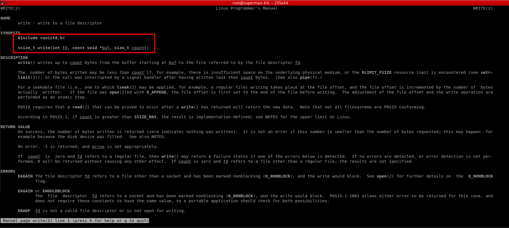
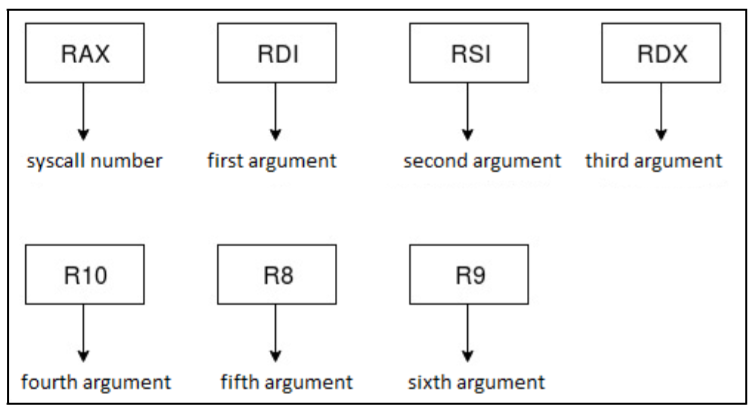
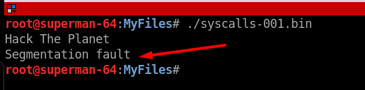
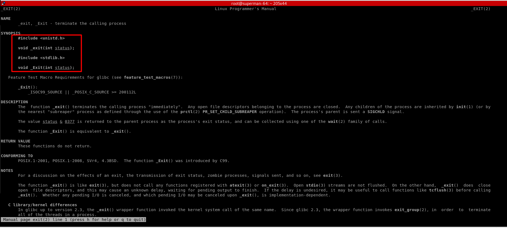
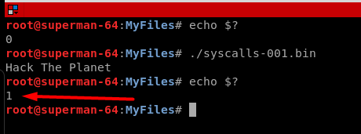
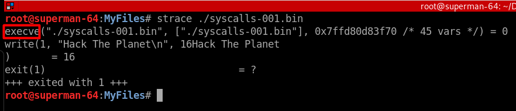
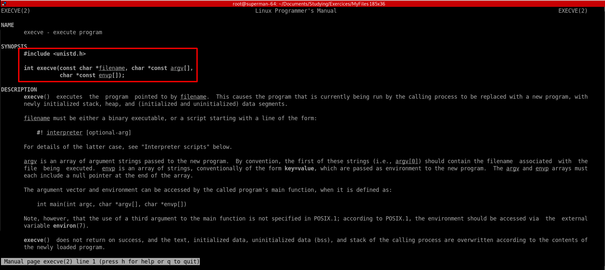
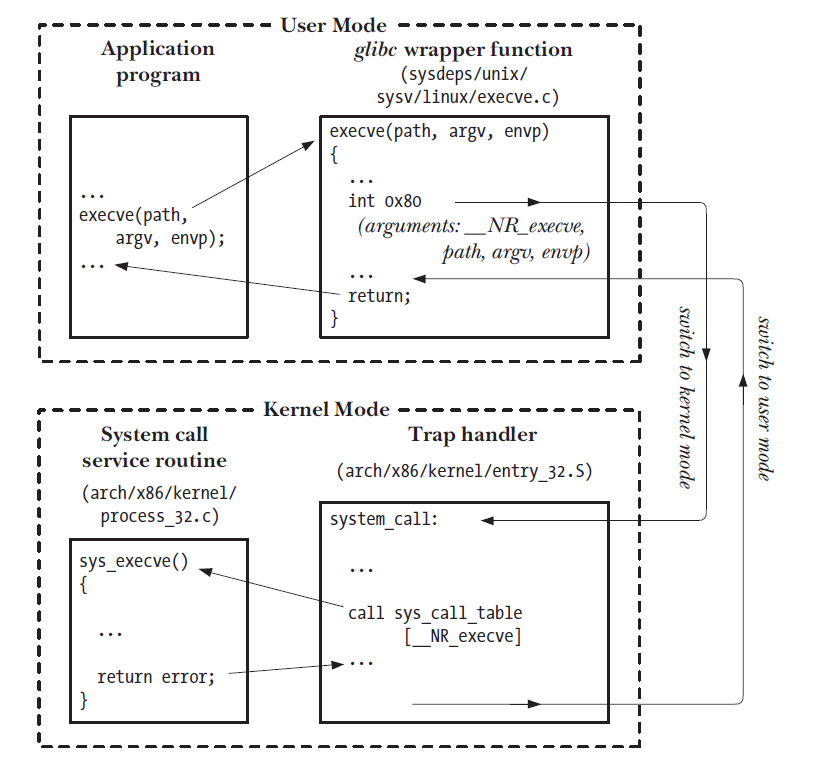
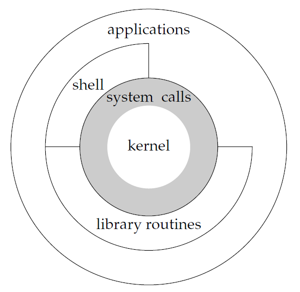

In this post we'll see how a process running in the **userland** can invoke **syscalls** to run system commands. We'll build a program, an Linux elf64 binary, to use some basics **syscalls** to print a message on the screen. For this task we'll take a look at the `write` syscall that allow us to print a message on the screen.

In Linux x64, we can use the file **.h** (header) bellow to find more information about the `write` syscall:

```code
$ cat /usr/include/x86_64-linux-gnu/asm/unistd_64.h | grep write 
#define __NR_write 1 
#define __NR_pwrite64 18 
#define __NR_writev 20 
#define __NR_pwritev 296 
#define __NR_process_vm_writev 311
#define __NR_pwritev2 328
```

Now that we know that must use the number **1** to call the write syscall, let's check the developer's manual to learn more about this syscall.

```code
$man 2 write
```
<a href="pics/write_syscall_1.png"></a>

As we can see, in this snipped code, the `write` syscall has three arguments:

**ssize_t write(int fd, const void \*buf, size_t count);**

The first argument is the file descriptor, which has three modes:

**0** -> Standard Input -> stdin
**1** -> Standard Output -> stdout
**2** -> Standard Error -> stderr

Reading the syscall manual, we learn how to setup our x64 arch registers to invoke syscalls:

<a href="pics/exit_syscall_reg_1.png"></a>

1. The syscall number goes in **RAX**
2. The first argument goes in **RDI**
3. The second argument goes in **RSI**
4. The third argument goes in **RDX**
5. The forth argument goes in **R10**
6. The fifth argument goes in **R8**
7. The sixth argument goes in **R9**


For our purpose we'll choose the standard output **1** to print the message on the screen. The second argument, will be a pointer to the string "*Hacking The Planet*", and the third argument will be the count for the string, including spaces, which in our case will be **16**.

```asm
global _start

section .text 

_start:
;
; Setting up the registers to print the message
; using the "write" syscall
;
	mov rax, 1 
	mov rdi, 1
	mov rsi, msg 
	mov rdx, length
	syscall

section .data
	msg: db 'Hack The Planet',0xa
	length: equ $-msg
```

Let's compile aqnd link this assembly pseudo code:

```code
nasm -felf64 syscall-001.nasm -o syscall-001.o
ld syscall-001.o -o syscall-001.bin
```

Once we run our program with **./syscall-001.bin** we can see that our message "Hack The Planet" is printed out on the screen, but the *Segmentation Fault* error message appears at the end of execution:

<a href="pics/write_syscall_2.png"></a>


If we want that our program exits nicely, then we have to use `exit` syscall. Let's take a deeper look at this issue.

Let's get back to that header file which contains all the syscalls for Linux x64:

```code
$ cat /usr/include/x86_64-linux-gnu/asm/unistd_64.h | grep exit 
#define __NR_exit 60
#define __NR_exit_group 231
#define __NR_exit_group 231
```

As we can see the `exit` syscall has the number 60. Let's check the **man page** for better understand this **syscall**.

```code
$man 2 exit
```

<a href="pics/exit_syscall_1.png"></a>


There is only one argument "**int status**" to define the exit status, for example, 0 (zero) status for no error:

```code
...<snip>
void _exit(int status);
<snip>...
```

So let's add the exit syscall portion to our program, and set the exit(1) just for testing.

```asm
global _start

section .text 

_start:
;
; Setting up the registers to print the message
; using the "write" syscall
;
	mov rax, 1 
	mov rdi, 1
	mov rsi, msg 
	mov rdx, length
	syscall

;
; Setting up the registers to call the "exit" syscall
; and exit normally with return 1
; Note: if we comment this the process will finish with
; Segmentation Fault error
;
	mov rax, 60 
	mov rdi, 1
	syscall


section .data
	msg: db 'Hack The Planet',0xa
	length: equ $-msg
```

Now, we compile the assembly pseudo code:

```code
nasm -felf64 syscall-001.nasm -o syscall-001.o
ld syscall-001.o -o syscall-001.bin
```

And after we run the *./syscall-001.bin*, we can check that the exit status is **"1"** as we designed to be.

<a href="pics/exit_syscall_2.png"></a>

If we use the `strace` command to analise this elf32 binary we shall see some interesting stuff. For example, we can see that when we run the binary, the shell uses an **execve** with our binary passed as an argument along with other environment variables.

<a href="pics/exit_syscall_3.png"></a>


<a href="pics/execve_1.png"></a>

----


<a href="pics/syscall_execution_1.png"></a>

<a href="pics/syscall_execution_2.png"></a>
